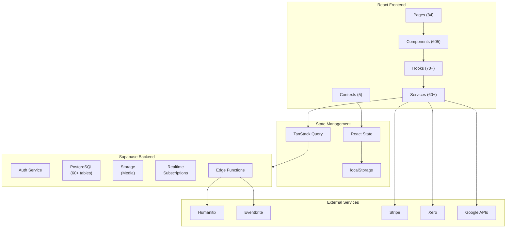
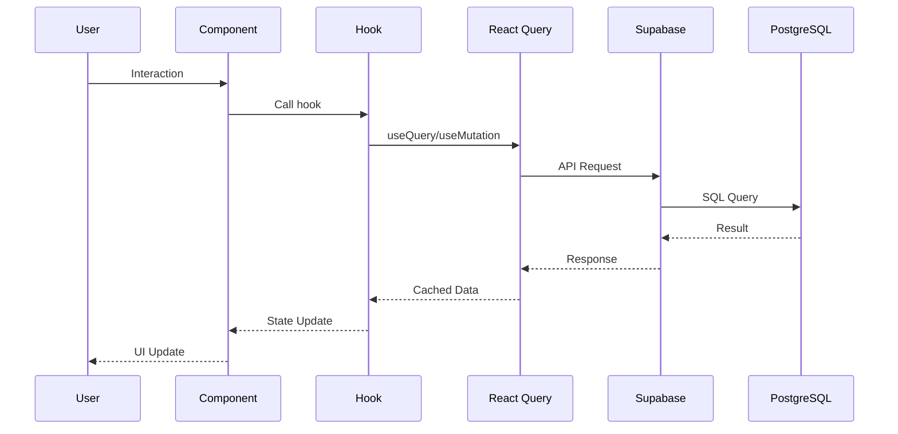

# System Architecture Map

High-level overview of Stand Up Sydney's architecture, component relationships, and external integrations.

---

## ASCII Architecture Overview

```
┌─────────────────────────────────────────────────────────────────────────────┐
│                         STAND UP SYDNEY PLATFORM                            │
├─────────────────────────────────────────────────────────────────────────────┤
│                                                                             │
│   ┌─────────────────────────────────────────────────────────────────────┐   │
│   │                    REACT FRONTEND (Vite + TS)                       │   │
│   ├─────────────────────────────────────────────────────────────────────┤   │
│   │                                                                     │   │
│   │  ┌──────────┐ ┌──────────┐ ┌──────────┐ ┌──────────┐ ┌──────────┐  │   │
│   │  │  Pages   │ │Components│ │ Contexts │ │  Hooks   │ │ Services │  │   │
│   │  │  (84)    │ │  (605)   │ │   (5)    │ │  (70+)   │ │  (60+)   │  │   │
│   │  └────┬─────┘ └────┬─────┘ └────┬─────┘ └────┬─────┘ └────┬─────┘  │   │
│   │       │            │            │            │            │        │   │
│   │       └────────────┴────────────┴────────────┴────────────┘        │   │
│   │                              │                                     │   │
│   │                    ┌─────────┴─────────┐                          │   │
│   │                    │  React Query      │                          │   │
│   │                    │  (Server State)   │                          │   │
│   │                    └─────────┬─────────┘                          │   │
│   └──────────────────────────────┼──────────────────────────────────────┘   │
│                                  │                                         │
├──────────────────────────────────┼──────────────────────────────────────────┤
│                                  │                                         │
│   ┌──────────────────────────────┴──────────────────────────────┐         │
│   │                      SUPABASE BACKEND                        │         │
│   ├──────────────────────────────────────────────────────────────┤         │
│   │  ┌──────────────┐ ┌──────────────┐ ┌──────────────────────┐  │         │
│   │  │   Auth       │ │  PostgreSQL  │ │   Realtime           │  │         │
│   │  │  (Users)     │ │  (60+ Tables)│ │   (Subscriptions)    │  │         │
│   │  └──────────────┘ └──────────────┘ └──────────────────────┘  │         │
│   │  ┌──────────────┐ ┌──────────────┐ ┌──────────────────────┐  │         │
│   │  │   Storage    │ │     RLS      │ │   Edge Functions     │  │         │
│   │  │  (Media)     │ │  (Policies)  │ │   (Webhooks)         │  │         │
│   │  └──────────────┘ └──────────────┘ └──────────────────────┘  │         │
│   └──────────────────────────────────────────────────────────────┘         │
│                                                                             │
├─────────────────────────────────────────────────────────────────────────────┤
│                          EXTERNAL INTEGRATIONS                              │
├─────────────────────────────────────────────────────────────────────────────┤
│                                                                             │
│   ┌─────────────┐  ┌─────────────┐  ┌─────────────┐  ┌─────────────┐       │
│   │  Humanitix  │  │ Eventbrite  │  │   Stripe    │  │    Xero     │       │
│   │ (Ticketing) │  │ (Ticketing) │  │ (Payments)  │  │(Accounting) │       │
│   └─────────────┘  └─────────────┘  └─────────────┘  └─────────────┘       │
│                                                                             │
│   ┌─────────────┐  ┌─────────────┐  ┌─────────────┐  ┌─────────────┐       │
│   │   Google    │  │   Postiz    │  │   Resend    │  │    CDN      │       │
│   │ (Calendar,  │  │  (Social)   │  │  (Email)    │  │  (Assets)   │       │
│   │  Maps)      │  │             │  │             │  │             │       │
│   └─────────────┘  └─────────────┘  └─────────────┘  └─────────────┘       │
│                                                                             │
└─────────────────────────────────────────────────────────────────────────────┘
```

---

## Provider Hierarchy (App.tsx)

The React context providers are nested in this specific order:

```
ErrorBoundary
└── HelmetProvider (SEO)
    └── QueryClientProvider (TanStack Query)
        └── ThemeProvider
            └── AuthProvider
                └── UserProvider
                    └── ProfileProvider
                        └── DesignSystemInitializer
                            └── Router
                                └── PlatformLayout
                                    └── <Routes />
```

**Key Provider Responsibilities:**

| Provider | Purpose | Key State |
|----------|---------|-----------|
| `ThemeProvider` | Dark/light mode | `theme`, `setTheme` |
| `AuthProvider` | Authentication | `user`, `session`, `hasRole()` |
| `UserProvider` | Extended user data | `profile`, `branding` |
| `ProfileProvider` | Multi-profile switching | `activeProfile`, `availableProfiles` |

---

## Tech Stack Summary

| Layer | Technology | Purpose |
|-------|------------|---------|
| **Build** | Vite | Fast dev server, HMR, bundling |
| **UI Framework** | React 18 | Component-based UI |
| **Type Safety** | TypeScript (strict) | Static type checking |
| **Styling** | Tailwind CSS | Utility-first CSS |
| **Components** | shadcn/ui + Radix | Accessible UI primitives |
| **Routing** | React Router v6 | Client-side routing |
| **Server State** | TanStack Query | Data fetching & caching |
| **Forms** | React Hook Form + Zod | Form state & validation |
| **Database** | Supabase (PostgreSQL) | Data persistence, auth, realtime |
| **PWA** | Service Worker | Offline support, installable |

---

## External Services Map

### Ticketing Platforms

```
┌──────────────┐         ┌──────────────┐
│  Humanitix   │         │  Eventbrite  │
│              │         │              │
│  ┌────────┐  │         │  ┌────────┐  │
│  │Webhooks│──┼────┐    │  │Webhooks│──┼────┐
│  └────────┘  │    │    │  └────────┘  │    │
└──────────────┘    │    └──────────────┘    │
                    ▼                        ▼
              ┌─────────────────────────────────┐
              │         Supabase Edge           │
              │         Functions               │
              └───────────────┬─────────────────┘
                              │
                              ▼
              ┌─────────────────────────────────┐
              │      events, orders, tickets    │
              │          (Database)             │
              └─────────────────────────────────┘
```

### Financial Integrations

```
┌──────────────┐                    ┌──────────────┐
│   Stripe     │                    │    Xero      │
│              │                    │              │
│ - Payments   │                    │ - Invoices   │
│ - Invoices   │                    │ - Bills      │
│ - Connect    │                    │ - Contacts   │
└──────┬───────┘                    └──────┬───────┘
       │                                   │
       │    ┌─────────────────────┐       │
       └───►│  Invoice Service    │◄──────┘
            │ src/services/       │
            │ invoiceService.ts   │
            └─────────────────────┘
```

---

## Mermaid Diagram: High-Level Architecture



---

## Route Categories

### Static Routes (Highest Priority)
- `/` - Landing page
- `/auth` - Login/signup
- `/dashboard` - Main dashboard
- `/gigs`, `/shows`, `/comedians` - Browse pages
- `/admin/*` - Admin pages
- `/crm/*` - CRM pages

### Dynamic Profile Routes
- `/comedian/:slug/*` - Comedian profiles
- `/manager/:slug/*` - Manager profiles
- `/photographer/:slug/*` - Photographer profiles
- `/org/:slug/*` - Organization profiles
- `/venue/:slug/*` - Venue profiles

### Event Routes
- `/events/:id` - Public event view
- `/events/:id/edit` - Edit event (protected)
- `/events/:id/manage` - Manage lineup (protected)
- `/events/:id/apply` - Apply to event (protected)

---

## Data Flow Overview



---

## Related Documentation

- **[02-DIRECTORY-GUIDE.md](./02-DIRECTORY-GUIDE.md)** - Detailed folder structure
- **[03-FEATURE-CONNECTIONS.md](./03-FEATURE-CONNECTIONS.md)** - Feature interactions
- **[diagrams/](./diagrams/)** - Mermaid source files
