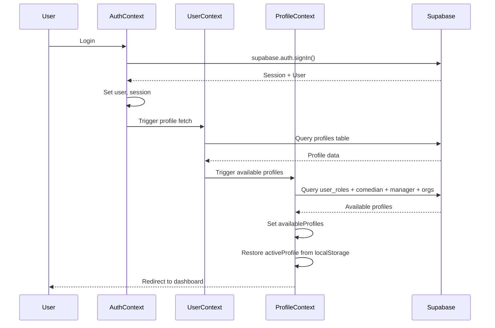
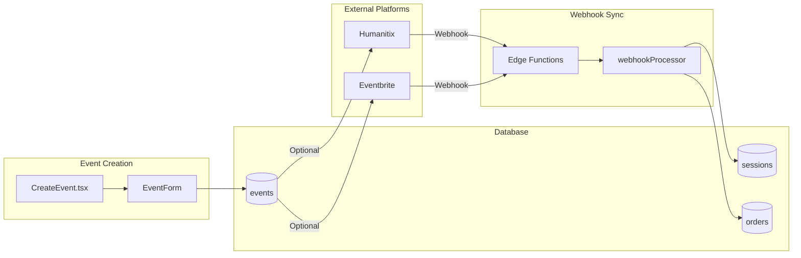
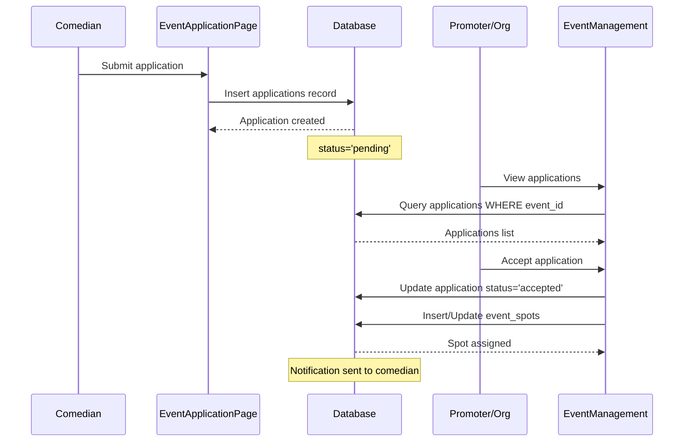
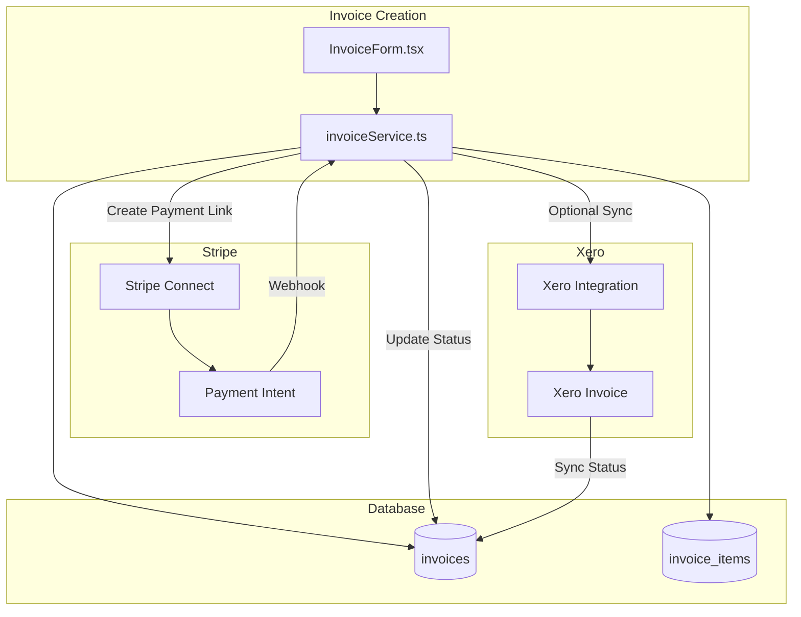
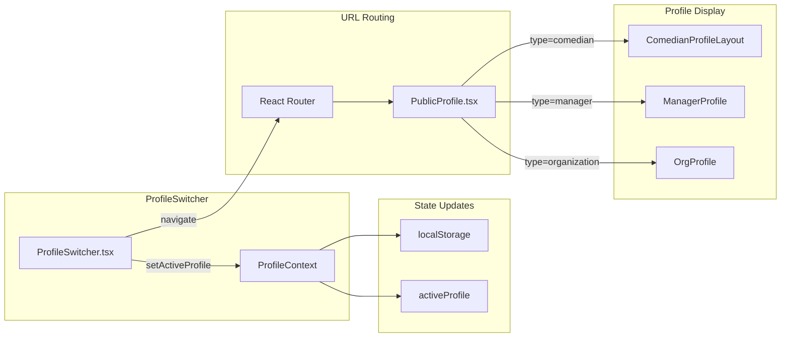

# Feature Connections

How features interact with each other, data flows between systems, and key integration points.

---

## Feature Dependency Overview

```
┌─────────────────────────────────────────────────────────────────────────┐
│                           FEATURE MAP                                   │
├─────────────────────────────────────────────────────────────────────────┤
│                                                                         │
│   ┌──────────────┐                                                     │
│   │     Auth     │                                                     │
│   │  (Required)  │                                                     │
│   └──────┬───────┘                                                     │
│          │                                                             │
│   ┌──────┴───────┐                                                     │
│   │   Profiles   │ ◄────────────────────────────────────┐             │
│   │   (Base)     │                                      │             │
│   └──────┬───────┘                                      │             │
│          │                                              │             │
│   ┌──────┴────────────────────────────────────────────┐│             │
│   │                                                   ││             │
│   ▼                    ▼                ▼             ▼│             │
│ ┌─────────┐     ┌───────────┐    ┌──────────┐   ┌─────────┐         │
│ │ Events  │────►│ Bookings  │───►│ Invoices │──►│ Payments│         │
│ │         │     │           │    │          │   │         │         │
│ └────┬────┘     └─────┬─────┘    └────┬─────┘   └────┬────┘         │
│      │                │               │              │               │
│      ▼                ▼               ▼              ▼               │
│ ┌─────────┐     ┌───────────┐    ┌──────────┐   ┌─────────┐         │
│ │Ticketing│     │ Calendar  │    │   Xero   │   │ Stripe  │         │
│ │(HTX/EB) │     │  (Google) │    │  Sync    │   │ Connect │         │
│ └─────────┘     └───────────┘    └──────────┘   └─────────┘         │
│                                                                       │
└─────────────────────────────────────────────────────────────────────────┘
```

---

## Core Data Flows

### 1. Authentication → Profile → Dashboard Flow



**Key Files:**
- `src/contexts/AuthContext.tsx` - Auth state
- `src/contexts/UserContext.tsx` - Profile data
- `src/contexts/ProfileContext.tsx` - Profile switching
- `src/pages/Dashboard.tsx` - Dashboard view

---

### 2. Event Creation → Ticketing → Sync Flow



**Key Files:**
- `src/pages/CreateEvent.tsx` - Event creation
- `src/services/humanitix/` - Humanitix integration
- `src/services/webhookProcessorService.ts` - Webhook handling
- Supabase Edge Functions - Webhook endpoints

---

### 3. Comedian Application → Spot Assignment Flow



**Key Files:**
- `src/pages/EventApplicationPage.tsx` - Application form
- `src/pages/EventManagement.tsx` - Manage lineup
- `src/components/event-management/` - Management UI
- `src/services/comedian/comedian-spot-service.ts` - Spot operations

---

### 4. Invoice → Stripe → Xero Sync Flow



**Key Files:**
- `src/components/InvoiceForm.tsx` - Invoice UI
- `src/services/invoiceService.ts` - Invoice logic
- `src/hooks/useXeroIntegration.ts` - Xero OAuth
- `src/pages/InvoicePaymentSuccess.tsx` - Payment callback

---

### 5. Profile Switching → URL Routing Flow



**Key Files:**
- `src/components/layout/ProfileSwitcher.tsx` - Switching UI
- `src/contexts/ProfileContext.tsx` - Profile state
- `src/pages/PublicProfile.tsx` - Profile routing
- `src/components/comedian-profile/ComedianProfileLayout.tsx` - Layout

---

## Feature Integration Points

### Shared Contexts

| Context | Used By | Purpose |
|---------|---------|---------|
| `AuthContext` | All protected features | User auth state |
| `ProfileContext` | Dashboard, Profile pages, Sidebar | Active profile |
| `UserContext` | Profile display, Settings | Extended user data |
| `ThemeContext` | All components | Dark/light mode |

### Shared Hooks

| Hook | Used By | Purpose |
|------|---------|---------|
| `useSlugValidation` | Profile forms, URL handling | Validate slugs |
| `useProfileData` | Profile pages | Fetch profile |
| `useNotifications` | Notification bell, Push | Manage notifications |
| `useXeroIntegration` | Invoices, Settings | Xero sync |

### Shared Services

| Service | Called By | Operations |
|---------|-----------|------------|
| `invoiceService` | InvoiceForm, Dashboard | Invoice CRUD |
| `comedianService` | ComedianProfile, Browse | Comedian queries |
| `ticketSyncService` | Event pages, Webhooks | Ticket sync |

---

## Feature Dependencies Matrix

| Feature | Depends On | Provides To |
|---------|-----------|-------------|
| **Auth** | - | All features |
| **Profiles** | Auth | Events, Bookings, CRM |
| **Events** | Auth, Profiles | Bookings, Ticketing |
| **Bookings** | Events, Profiles | Invoices, Calendar |
| **Invoices** | Bookings, Profiles | Payments, Xero |
| **Payments** | Invoices | Reporting |
| **Ticketing** | Events | Orders, Revenue |
| **CRM** | Profiles, Events | Reporting |
| **Calendar** | Bookings, Events | - |

---

## Cross-Feature Data Queries

### Events with Full Context
```typescript
// Get event with bookings, spots, and applications
const eventWithContext = await supabase
  .from('events')
  .select(`
    *,
    event_spots(*),
    applications(*),
    comedian_bookings(*, profiles(*))
  `)
  .eq('id', eventId)
  .single();
```

### Profile with All Roles
```typescript
// Get user with all profile types
const profileWithRoles = await supabase
  .from('profiles')
  .select(`
    *,
    user_roles(*),
    comedians(*),
    managers(*),
    photographers(*),
    videographers(*)
  `)
  .eq('id', userId)
  .single();
```

### Invoice with Full Details
```typescript
// Get invoice with items and recipients
const invoiceDetails = await supabase
  .from('invoices')
  .select(`
    *,
    invoice_items(*),
    invoice_recipients(*),
    invoice_payments(*)
  `)
  .eq('id', invoiceId)
  .single();
```

---

## Integration Event Chains

### When Event is Created
1. `events` table insert
2. Default `event_spots` created
3. Optional Humanitix event link
4. Optional Eventbrite event link
5. Calendar sync trigger

### When Application is Accepted
1. `applications` status updated
2. `event_spots` comedian_id set
3. Notification created
4. Calendar event added
5. Optional invoice generated

### When Payment Received
1. Stripe webhook received
2. `invoice_payments` record created
3. `invoices` status updated
4. Optional Xero sync
5. Email notification sent

---

## Related Documentation

- **[01-SYSTEM-MAP.md](./01-SYSTEM-MAP.md)** - Architecture overview
- **[04-DATABASE-OVERVIEW.md](./04-DATABASE-OVERVIEW.md)** - Schema details
- **[Features/](../Features/)** - Individual feature docs
