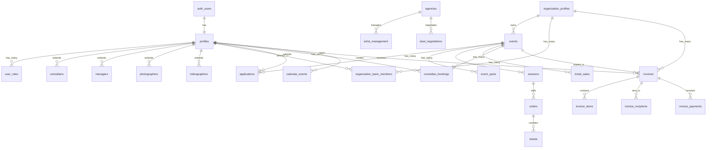

# Database Overview

Schema documentation for Stand Up Sydney's Supabase PostgreSQL database, including table relationships, key domains, and common query patterns.

---

## Entity Relationship Diagram



---

## Table Domains

### 1. Authentication & Profiles

Core identity and role management.

| Table | Purpose | Key Columns | RLS |
|-------|---------|-------------|-----|
| `profiles` | Base user profile | `id`, `email`, `name`, `stage_name`, `url_slug`, `profile_visible` | Yes |
| `user_roles` | User role assignments | `user_id`, `role` (comedian, promoter, admin, manager, organization, comedian_lite) | Yes |
| `comedians` | Comedian-specific data | `id`, `comedy_styles`, `experience_level`, `price_range` | Yes |
| `managers` | Manager profiles | `id`, `organization_id`, `specialties` | Yes |
| `photographers` | Photographer profiles | `id`, `specialties`, `equipment`, `hourly_rate` | Yes |
| `videographers` | Videographer profiles | `id`, `specialties`, `equipment`, `hourly_rate` | Yes |
| `organization_profiles` | Organization data | `id`, `owner_id`, `url_slug`, `name`, `gst_registered` | Yes |
| `organization_team_members` | Org membership | `organization_id`, `user_id`, `role`, `permissions` | Yes |

**Key Relationships:**
- `profiles.id` → `auth.users.id` (1:1)
- `user_roles.user_id` → `profiles.id`
- `comedians.id` / `managers.id` / etc. → `profiles.id`

---

### 2. Events & Booking

Event management and performer booking workflow.

| Table | Purpose | Key Columns | RLS |
|-------|---------|-------------|-----|
| `events` | Event listings | `id`, `promoter_id`, `organization_id`, `title`, `event_date`, `status`, `humanitix_event_id` | Yes |
| `event_spots` | Performance slots | `event_id`, `comedian_id`, `spot_name`, `payment_amount`, `confirmation_status`, `gst_mode` | Yes |
| `applications` | Comedian applications | `event_id`, `comedian_id`, `status`, `is_shortlisted`, `session_source_id` | Yes |
| `spot_assignments` | Spot assignment records | `event_id`, `spot_id`, `comedian_id`, `application_id` | Yes |
| `event_templates` | Reusable event configs | `promoter_id`, `name`, `template_data` | Yes |
| `event_co_promoters` | Co-promoter access | `event_id`, `user_id`, `is_active` | Yes |
| `event_waitlists` | Event waitlists | `event_id`, `email`, `position` | Yes |
| `comedian_bookings` | Booking records | `event_id`, `comedian_id`, `performance_fee`, `payment_status` | Yes |

**Key Relationships:**
- `events.organization_id` → `organization_profiles.id`
- `events.promoter_id` → `auth.users.id`
- `event_spots.event_id` → `events.id`
- `applications.event_id` → `events.id`
- `applications.comedian_id` → `profiles.id`

---

### 3. Ticketing & Sessions

External ticketing platform sync (Humanitix, Eventbrite).

| Table | Purpose | Key Columns | RLS |
|-------|---------|-------------|-----|
| `sessions` | Event sessions/showtimes | `event_id`, `source`, `source_id`, `name`, `starts_at`, `capacity`, `sold_count` | Yes |
| `orders` | Ticket orders | `source`, `source_id`, `session_source_id`, `purchaser_email`, `total_cents` | Yes |
| `tickets` | Individual tickets | `order_id`, `ticket_type`, `quantity`, `attendee_name` | Yes |
| `ticket_sales` | Sale records | `event_id`, `customer_email`, `ticket_quantity`, `platform`, `refund_status` | Yes |
| `ticket_platforms` | Platform connections | `event_id`, `platform_name`, `platform_event_id` | Yes |
| `customers` | Customer database | `email`, `first_name`, `last_name`, `source`, `total_orders` | Yes |

**Key Relationships:**
- `sessions.event_id` → `events.id`
- `orders.session_source_id` → `sessions.source_id` (external ID)
- `tickets.order_id` → `orders.id`

---

### 4. Financial & Invoicing

Invoice generation, payments, and accounting sync.

| Table | Purpose | Key Columns | RLS |
|-------|---------|-------------|-----|
| `invoices` | Invoice records | `id`, `invoice_number`, `organization_id`, `status`, `tax_treatment`, `total_amount` | Yes |
| `invoice_items` | Line items | `invoice_id`, `description`, `quantity`, `unit_price`, `tax_amount` | Yes |
| `invoice_recipients` | Bill-to contacts | `invoice_id`, `recipient_name`, `recipient_email`, `abn` | Yes |
| `invoice_payments` | Payment records | `invoice_id`, `amount`, `payment_method`, `is_deposit` | Yes |
| `invoice_payment_links` | Stripe payment links | `invoice_id`, `stripe_payment_link_id`, `url` | Yes |
| `recurring_invoices` | Recurring templates | `comedian_id`, `promoter_id`, `frequency`, `next_invoice_date` | Yes |

**Key Relationships:**
- `invoices.organization_id` → `organization_profiles.id`
- `invoices.event_id` → `events.id`
- `invoice_items.invoice_id` → `invoices.id`

---

### 5. Xero Integration

Accounting sync with Xero.

| Table | Purpose | Key Columns | RLS |
|-------|---------|-------------|-----|
| `xero_integrations` | OAuth connections | `user_id`, `tenant_id`, `access_token`, `connection_status` | Yes |
| `xero_contacts` | Synced contacts | `profile_id`, `xero_contact_id`, `sync_status` | Yes |
| `xero_invoices` | Synced invoices | `event_id`, `xero_invoice_id`, `invoice_status`, `sync_status` | Yes |
| `xero_bills` | Synced bills | `comedian_booking_id`, `xero_bill_id`, `bill_status` | Yes |

---

### 6. Event Costs & Reporting

Cost tracking and financial reports.

| Table | Purpose | Key Columns | RLS |
|-------|---------|-------------|-----|
| `venue_costs` | Venue expenses | `event_id`, `cost_type`, `amount`, `payment_status` | Yes |
| `marketing_costs` | Marketing spend | `event_id`, `platform`, `amount`, `impressions`, `conversions` | Yes |
| `batch_payments` | Bulk payments | `event_id`, `selected_bookings`, `processing_status` | Yes |
| `financial_reports` | Generated reports | `event_id`, `total_ticket_revenue`, `net_profit` | Yes |

---

### 7. Calendar & Availability

Calendar sync and availability tracking.

| Table | Purpose | Key Columns | RLS |
|-------|---------|-------------|-----|
| `calendar_events` | Comedian calendars | `comedian_id`, `event_id`, `event_date`, `status`, `calendar_sync_status` | Yes |
| `calendar_integrations` | OAuth connections | `user_id`, `provider`, `calendar_id`, `is_active` | Yes |
| `comedian_blocked_dates` | Unavailable dates | `comedian_id`, `blocked_date`, `reason` | Yes |
| `personal_gigs` | Manual gig entries | `user_id`, `title`, `event_date`, `venue` | Yes |

---

### 8. Communication

Messaging, notifications, and reviews.

| Table | Purpose | Key Columns | RLS |
|-------|---------|-------------|-----|
| `messages` | Direct messages | `sender_id`, `recipient_id`, `organization_id`, `content`, `read_at` | Yes |
| `notifications` | User notifications | `user_id`, `type`, `title`, `message`, `is_read` | Yes |
| `vouches` | User endorsements | `voucher_id`, `vouchee_id`, `rating`, `organization_id` | Yes |
| `comedian_reviews` | Comedian reviews | `comedian_id`, `reviewer_name`, `rating`, `review_text` | Yes |
| `contact_requests` | Contact requests | `requester_id`, `comedian_id`, `request_type`, `status` | Yes |

---

### 9. CRM & Agencies

Customer relationship and talent management.

| Table | Purpose | Key Columns | RLS |
|-------|---------|-------------|-----|
| `agencies` | Agency profiles | `id`, `name`, `agency_type`, `commission_rate`, `status` | No |
| `artist_management` | Artist-agency relationships | `artist_id`, `agency_id`, `commission_rate`, `relationship_status` | No |
| `deal_negotiations` | Deal tracking | `deal_type`, `status`, `artist_id`, `promoter_id`, `proposed_amount` | Yes |
| `tasks` | CRM tasks | `assignee_id`, `title`, `due_date`, `status`, `priority` | Yes |

---

### 10. Media & Content

Profile media and content management.

| Table | Purpose | Key Columns | RLS |
|-------|---------|-------------|-----|
| `media_files` | Uploaded media | `user_id`, `file_path`, `media_type`, `is_profile_video` | Yes |
| `comedian_section_order` | EPK section ordering | `user_id`, `section_order` | Yes |
| `social_posts` | Social media posts | `event_id`, `platform`, `content`, `scheduled_at` | Yes |

---

## Row Level Security (RLS) Summary

All user-facing tables have RLS enabled. Key policy patterns:

| Pattern | Description | Example Tables |
|---------|-------------|----------------|
| **Owner access** | User owns the record | `profiles`, `invoices`, `calendar_events` |
| **Organization member** | User is org team member | `events`, `organization_profiles` |
| **Public read** | Anyone can view | `events` (open status), `profiles` (visible) |
| **Role-based** | Specific roles only | `admin` tables, CRM data |

---

## Common Query Patterns

### Fetch User with All Roles

```typescript
const { data } = await supabase
  .from('profiles')
  .select(`
    *,
    user_roles(role),
    comedians(*),
    managers(*),
    photographers(*),
    videographers(*)
  `)
  .eq('id', userId)
  .single();
```

### Fetch Event with Full Context

```typescript
const { data } = await supabase
  .from('events')
  .select(`
    *,
    organization_profiles(id, name, url_slug),
    event_spots(*, profiles:comedian_id(id, stage_name, avatar_url)),
    applications(*, profiles:comedian_id(id, stage_name)),
    sessions(*)
  `)
  .eq('id', eventId)
  .single();
```

### Fetch Applications with Comedian Data

```typescript
const { data } = await supabase
  .from('applications')
  .select(`
    *,
    comedian:comedian_id(
      id, stage_name, avatar_url, bio,
      comedians(comedy_styles, experience_level)
    ),
    event:event_id(id, title, event_date)
  `)
  .eq('event_id', eventId)
  .order('applied_at', { ascending: false });
```

### Fetch Invoice with All Details

```typescript
const { data } = await supabase
  .from('invoices')
  .select(`
    *,
    invoice_items(*, item_order),
    invoice_recipients(*),
    invoice_payments(*)
  `)
  .eq('id', invoiceId)
  .single();
```

### Fetch Organization Events

```typescript
const { data } = await supabase
  .from('events')
  .select(`
    *,
    event_spots(count),
    applications(count),
    ticket_sales(sum:ticket_quantity)
  `)
  .eq('organization_id', orgId)
  .order('event_date', { ascending: false });
```

### Fetch Sessions with Orders

```typescript
const { data } = await supabase
  .from('sessions')
  .select(`
    *,
    orders(
      id, purchaser_email, total_cents,
      tickets(*)
    )
  `)
  .eq('event_id', eventId);
```

---

## Key Indexes

Performance-critical indexes exist on:

- `profiles(email)` - Unique
- `profiles(url_slug)` - Unique
- `events(event_date)` - Date filtering
- `events(organization_id)` - Org lookup
- `events(humanitix_event_id)` - External sync
- `applications(event_id, comedian_id)` - Unique constraint
- `sessions(source, source_id)` - External sync
- `orders(source, source_id)` - External sync
- `invoices(invoice_number)` - Unique

---

## Type Regeneration

When schema changes, regenerate TypeScript types:

```bash
# Using Supabase CLI
npx supabase gen types typescript --project-id $PROJECT_ID > src/integrations/supabase/types/index.ts
```

Types are located at `src/integrations/supabase/types/`.

---

## Migration History

Migrations are stored in `supabase/migrations/` with timestamped filenames:

```
supabase/migrations/
├── 20240101000000_initial_schema.sql
├── 20240215000000_add_organizations.sql
├── 20240301000000_add_sessions_orders.sql
└── ... (200+ migration files)
```

View migrations via Supabase MCP:
```typescript
mcp__supabase__list_migrations()
```

---

## Related Documentation

- **[01-SYSTEM-MAP.md](./01-SYSTEM-MAP.md)** - Architecture overview
- **[03-FEATURE-CONNECTIONS.md](./03-FEATURE-CONNECTIONS.md)** - Feature interactions
- **[05-COMMON-PATTERNS.md](./05-COMMON-PATTERNS.md)** - Code patterns
- **`src/integrations/supabase/types/`** - Auto-generated TypeScript types
