# Optimal Development Workflows for Claude + User Setup

## 🚀 Workflow 1: Live Development with Frequent Pushes (RECOMMENDED)


**Commands:**
```bash
# Claude's side (every 5-10 minutes of work)
git checkout -b feature/notification-badges
# ... make changes ...
git add -A && git commit -m "Add blinking animation to badges"
git push origin feature/notification-badges

# User's side
git fetch && git checkout feature/notification-badges
npm run dev
# View at http://localhost:5173
```

**Pros:** 
- User sees changes almost in real-time
- Easy rollback if needed
- Clean git history

**Cons:** 
- Requires user to actively pull and run dev server

---

## 🔄 Workflow 2: Dev Branch with Auto-Deploy

```mermaid
graph TD
    A[User requests features] --> B[Claude works on dev branch]
    B --> C[Claude pushes to dev frequently]
    C --> D[Vercel auto-deploys dev branch]
    D --> E[User views at dev-gigpig.vercel.app]
    E --> F{Batch of features complete?}
    F -->|No| B
    F -->|Yes| G[Claude creates PR: dev → main]
    G --> H[User reviews & merges]
    
    style A fill:#e1f5e1
    style D fill:#f5f5e1
    style E fill:#e1e5f5
    style H fill:#f5e1e1
```



**Setup (one-time):**
```bash
# In Vercel dashboard:
# 1. Add new deployment
# 2. Set branch to 'dev'
# 3. Get preview URL
```

**Commands:**
```bash
# Claude's side
git checkout dev
git pull origin dev
# ... make changes ...
git add -A && git commit -m "Complete PRD task #3"
git push origin dev

# Auto-deploys to: https://gigpig-dev.vercel.app
```

**Pros:** 
- No local setup needed for user
- Always accessible preview
- Multiple features can be tested together

**Cons:** 
- Slight deployment delay (1-2 min)
- Dev branch can get messy

---

## 🎯 Workflow 3: Feature Branches with Preview Deployments


**Commands:**
```bash
# Claude's side
git checkout -b feature/apply-button-states
# ... implement feature ...
git add -A && git commit -m "Enhance apply button states"
git push origin feature/apply-button-states

# Create PR via GitHub CLI
gh pr create --title "Apply button state management" \
  --body "Implements PRD task: Apply → Applying → Applied"

# Vercel automatically creates preview at:
# https://gigpig-pr-123.vercel.app
```

**Pros:** 
- Each feature isolated and testable
- Automatic preview URLs
- Clean PR-based workflow
- No local setup needed

**Cons:** 
- More formal process
- Multiple preview deployments

---

## 📊 Workflow Comparison

| Aspect | Workflow 1 | Workflow 2 | Workflow 3 |
|--------|-----------|-----------|-----------|
| **Speed to Preview** | Immediate (local) | 1-2 min | 2-3 min |
| **User Effort** | High (pull & run) | Low (just browse) | Low (just browse) |
| **Git Cleanliness** | Medium | Low | High |
| **Isolation** | High | Low | High |
| **Best For** | Active co-development | Continuous progress | Formal reviews |

## 🎨 Recommended Hybrid Approach

```bash
# For small fixes/updates
git checkout dev
git pull origin dev
# ... quick fixes ...
git push origin dev

# For major features
git checkout -b feature/big-feature
# ... implement ...
git push origin feature/big-feature
gh pr create

# For experimentation
git checkout -b experiment/wild-idea
# ... try things ...
# If good: PR, If bad: delete branch
```

## 🔥 Quick Commands Cheatsheet

```bash
# Claude's most-used commands
alias qadd="git add -A && git commit -m"
alias qpush="git push origin HEAD"
alias qpr="gh pr create"

# Usage
qadd "Fix notification badge styling"
qpush
qpr --title "Notification improvements"
```